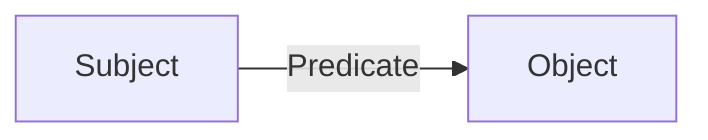
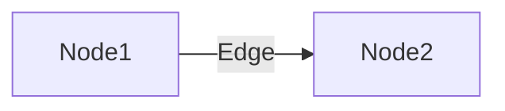
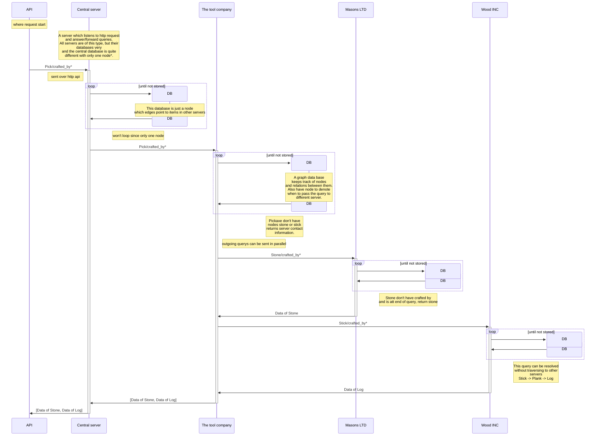
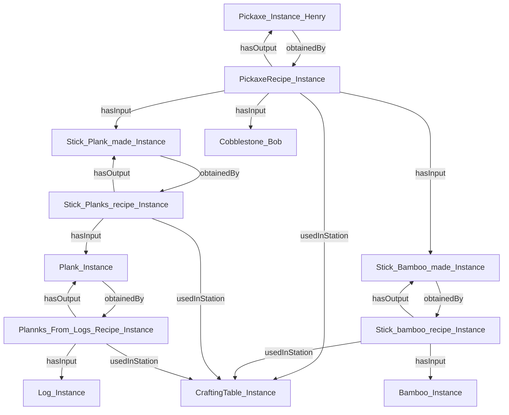
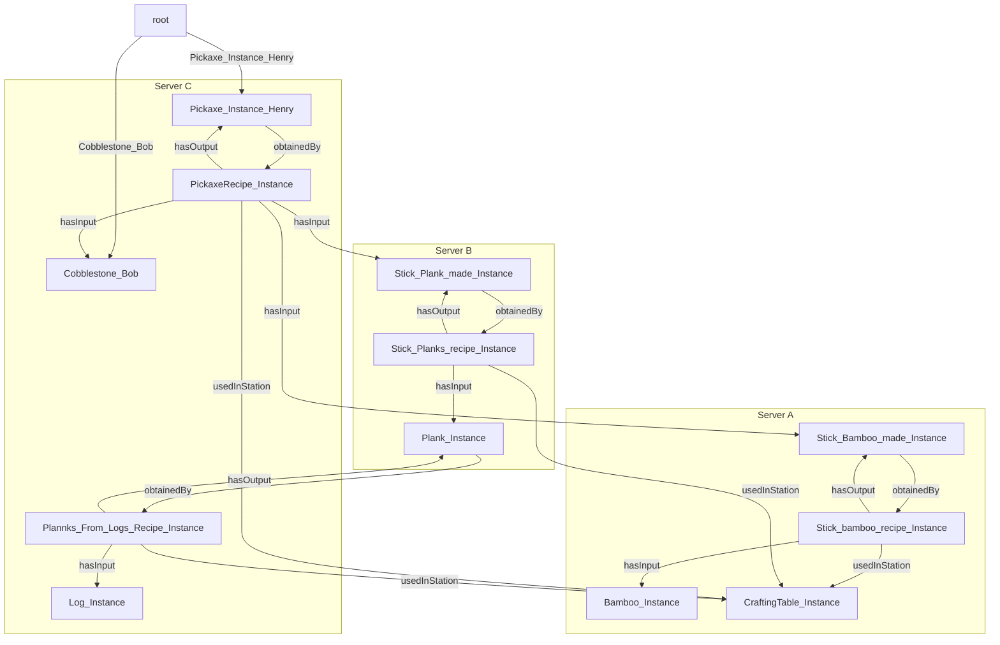
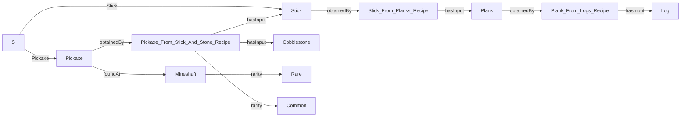

# Path-Expression-Traversal-System


PETS, a system to store linked distributed data with traversal functions

## Ontologies

An Ontology is a way to describe a reletionship with a stucture of subject, predicate and object. And our data is therefore a list of these structures which can be describe as following:



We call all subjects and objects nodes and predicates edges.



What we want to do is to search such an ontology strucure using a queary where this structure is spread over several servers.

## Architecture


<!-- Explain in words what happens in the sequence diagram -->

## Node ontologies



## Node ontologies distributed



## Truly distributed data


## Query structure

The query structure was designed for simplicity and not fines, the goal was an easy way to write path expressions with loops.



### Example 1, Simple traversal

To follow a simple path, first have the starting node (s in this case a we have not implemented a dht to resolve node location) followed by the edges name separated by `/`

`S/Pickaxe/obtainedBy/crafting_recipe/hasInput`

The example will start att pickaxe and follow edge `obtainedBy` to `Pickaxe_From_Stick_And_Stone_Recipe`
where the query will split and go to both `Cobblestone` and `stick`.
Since this is the end of the query they are returned.

### Example 2, Loop

Looping expressions, matching more than once, allowing for following a path of unknown length. The syntax is the to add a star around a group ``{...}*``

``S/Pickaxe/{obtainedBy/hasInput}*``

Will see what pick is made of recursively down to its minimal component, the paths are

```text
Pickaxe --> Pickaxe_From_Stick_And_Stone_Recipe --> Stick --> Stick_From_Planks_Recipe --> Plank --> Plank_From_Logs_Recipe --> Log
Pickaxe --> Pickaxe_From_Stick_And_Stone_Recipe --> Cobblestone
```

Where both Cobblestone and Log would be returned.

### Example 3, Or

Allows a path traversal to follow either edge

``S/Pickaxe/{obtainedBy/rarity|foundAt}/rarity``

```text
Pickaxe --> Pickaxe_From_Stick_And_Stone_Recipe --> Common
Pickaxe --> Mineshaft --> Rare
```

### Example 4, AND

Only allows the query to continue if both edges exist on the node, both are traversed

``S/Pickaxe/{obtainedBy & foundAt}/rarity`` would return

```text
Pickaxe --> Pickaxe_From_Stick_And_Stone_Recipe --> Common
Pickaxe --> Mineshaft --> Rare
```

``S/Stick/{obtainedBy & foundAt}/rarity`` would return nothing as stick dont have the edge foundAt.

### Example 5, groups {}

TODO EXPLAIN MORE

S/Pick/{(made_of & Crafting_recipie)/made_of}

### example arguments (), TO BE DECIDED

arguments could be added to loop operator?

## Example of internal structure of a query

Lets take an example query af show its internal evaluation

``S/Pickaxe/{obtainedBy/hasInput}*``

This is then converted to a tree structure of operations, where the leafs are edges and.

<!-- Note to readers, this look incredibly like the state machines that regex compiles to -->


### An example of evaluation

lets say that we are on edge ``obtainedBy``, and we want to know whats next.
By looking at the parent we know that we are on the left side of an *traverse*
and the next edge is the one on the right of the traverse, ``hasInput``

if whe should get the next node from ``hasInput`` we can again look att the parent
and se that we are on the right side of the *traverse*,
to find the next node we need to look higher, the *traverse*'s parent.
This gives us the knowledge that we are on the left side of *loop* operator (aka *zero or more*)
We then have two possible options continue right or redo the left side.
by evaluating the left side we get ``obtainedBy`` again, showing us that the *loop* works.
the right sides gives us NULL, the end of the query an valid position to return.

## go style pseudo code

Note that this pseudo code

```go
type TraverseNode Struct{
    Parent  *Node
    Left    *Node
    Right   *Node
}

// when calling this function we need to know where this was called from, was it our parent, left or right, there for passing a pointer to caller is necessary
// the function return array of pointers to the leafs/query edges, which can be used to determine the next node(s)
func (self TraverseNode) nextEdge(caller *Node) []*LeafNode {
    // if the caller is parent, we should deced into the left branch,
    if caller == self.parent {
        return self.left.nextEdge(&self)
    }
    // when the left branch has evaluated it will call us again
    // an we than have to evaluate the right branch
    else if caller == self.left {
        self.right.nextEdge(&self)
    }
    // when the right brach has evaluated it will call us again
    // we then know we have been fully evaluated and can call our parent saying we are done
    else if caller == self.right {
        self.parent.nextEdege(&self)
    } else {
        log.fatal("i dont know what should happen here?")
    }
}

type LeafNode Struct {
    Parent      *Node
    edgeName    string
}

// we are asked what the next edge is, this LeafNode represent that edge
func (self LeafNode) nextEdge(caller *Node) []*LeafNode {
    if caller == self.parent {
        return [&self]
    } else {
        log.fatal("i dont know what should happen here?")
    }
}

type LoopNode Struct{
    Parent  *Node
    Left    *Node
    Right   *Node
}

func (self LoopNode) nextEdge(caller *Node) []*LeafNode {
    // if the caller is parent, the possible outcomes are that we match zero of the edges and move on with the right branch
    // or that we match whatever in the left brach, therefore we return the next edges
    // an therefore return 
    // if this was match one and more instead of zero or more, calling right would not be the right option as it then would progress forward without having matched anything on the left
    // maybe add an + operator which is match one or more?
    if caller == self.parent {
        return [self.left.nextEdge(&self),self.right.nextEdge(&self)]
    }
    // when the left branch has evaluated it will call us again
    // we can continue the loop so left is an valid option, but we could also exit
    // this leads to the same output as the caller was the parent
    else if caller == self.left {
        return [self.left.nextEdge(&self),self.right.nextEdge(&self)]
    }
    // when the right brach has evaluated it will call us again
    // we then know we have been fully evaluated and can call our parent saying we are done
    else if caller == self.right {
        self.parent.nextEdge(&self)
    } else {
        log.fatal("i dont know what should happen here?")
    }
}

type OrNode Struct{
    Parent  *Node
    Left    *Node
    Right   *Node
}

func (self OrNode) nextEdge(caller *Node) []*LeafNode {
    // if the parent calls us we could either match each side, so both sides are an alternative
    if caller == self.parent {
        return [self.left.nextEdge(&self),self.right.nextEdge(&self)]
    }
    // if the left side calls us we have then completed one of the options and are fully evaluated, an the call our parent saying we are done, and let them get the next edge
    else if caller == self.left {
        self.parent.nextEdge(&self)
    }
    // same ass above
    else if caller == self.right {
        self.parent.nextEdge(&self)
    } else {
        log.fatal("i dont know what should happen here?")
    }
}

```
