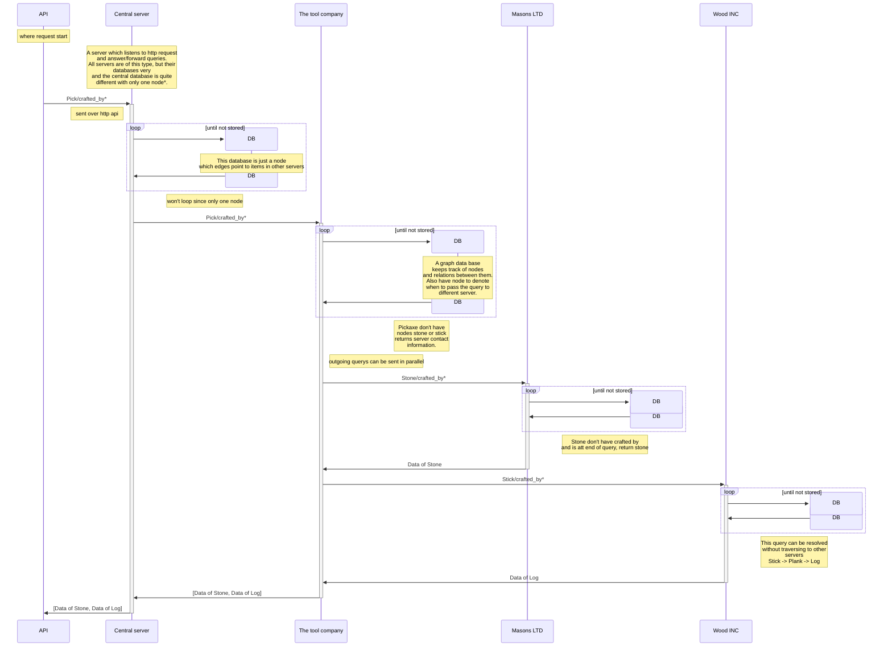
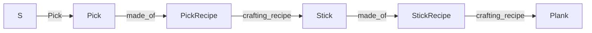

# Path-Expression-Traversal-System

PETS, a system to store linked distributed data with traversal functions

## Architecture

## Query structure

The query structure was designed for simplicity and not fines, the goal was an easy way to write path expressions with loops

### Example 1, Simple treversal

S/Pick/{Made_of/crafting_recipe}

Will take traverse from the start server containing the Pick to a what it is made of to what that things crafting recipe

### Example 2, Loop

S/Pick/{Made_of}*

Will see what pick is made of recursivly down to its minimal component

### Example 3, Or

S/Pick/{Made_of | Crafting_recipie}

Will return either what it was made of or its crafting recipie

### Example 4, AND

S/Pick/{Made_of & Crafting_recipie}

Will return both what it is made of and its crafting recipie

### Example 5, ()

S/Pick/{(made_of & Crafting_recipie)/made_of}

###
