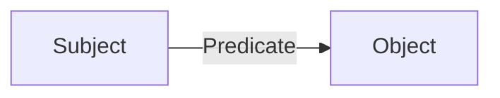
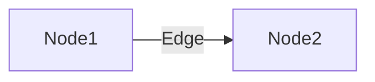
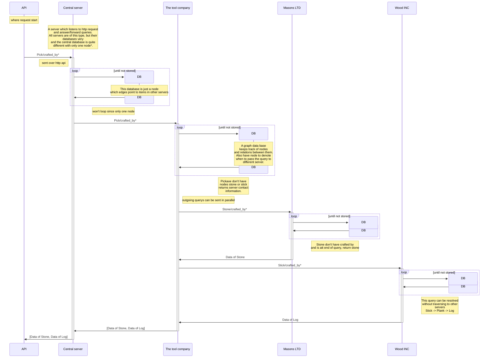
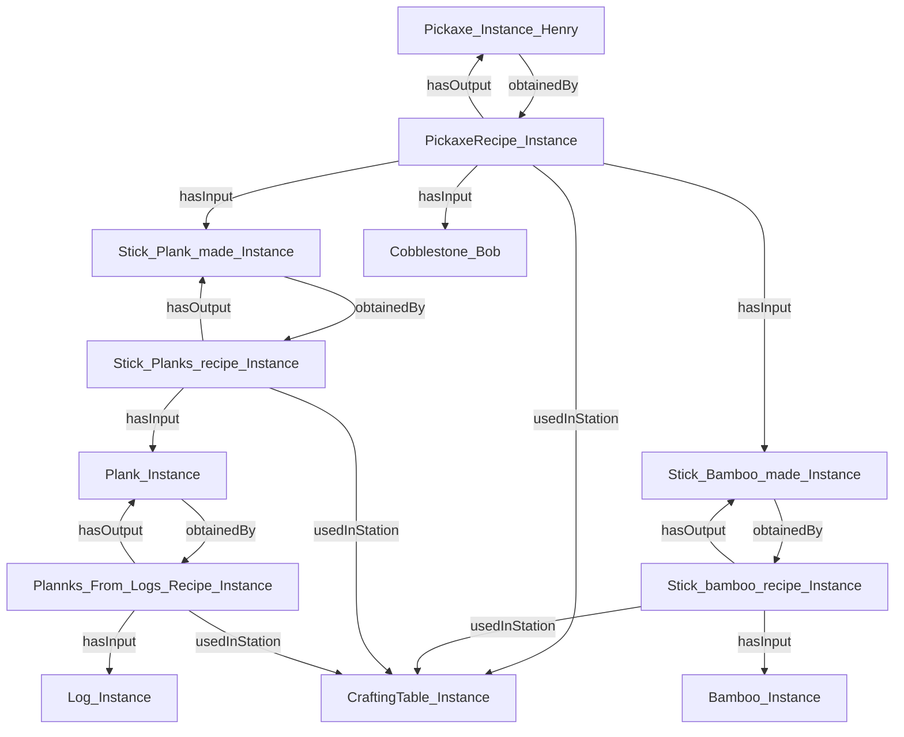
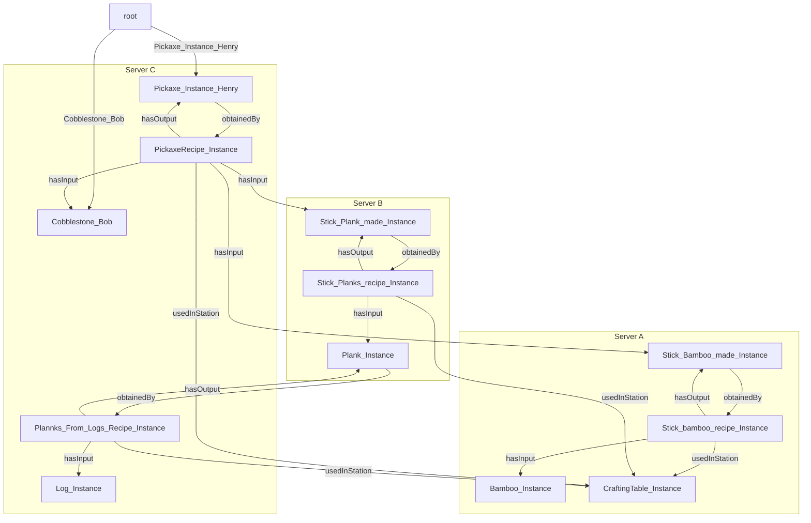
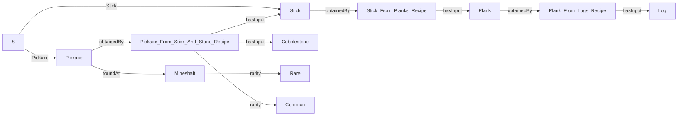

# Path-Expression-Traversal-System


PETS, a system to store linked distributed data with traversal functions

## Introduction

Our system is designed to navigate and retrieve information from linked ontologies using path expressions. It enables users to traverse decentralized data structures by following relationships defined in path expressions, allowing for multilevel hierarchical exploration. 
The system helps users efficiently access and analyze linked data. For example in a supply chain context, it can model the entire distribution network of a specific item by retrieving manufacturer data at each stage. This provides transparency, traceability, and deeper insights into complex data relationships. 
Our solution is valuable for businesses, researchers, and data analysts who needs to explore and make sense of decentralized, linked data in a clear ond structured way.

## Ontologies

An Ontology is a way to describe a reletionship with a stucture of subject, predicate and object. And our data is therefore a list of these structures which can be describe as following:



We call all subjects and objects nodes and predicates edges.



What we want to do is to search such an ontology strucure using a queary where this structure is spread over several servers.

## Parsing the ontologies into GoLang

For this parsing function, nodes have been defined as struct containing an array (or slices in GoLang) with edges to the node. We also create a struct for edges with the properties "EdgeName" and "TargetName" with each property denoting how an item is obtained respectively what the edge is pointing to. One server can then save all these nodes in a hashmap (dictionary) with the key being the node name and the value, the DataNode struct.
```go
type DataNode struct {
    Edges []DataEdge
}
type DataEdge struct { // minecraft:obtainedBy minecraft:Stick_bamboo_recipe_Instance
    EdgeName   string  // obtainedBy
    TargetName string  // Stick_bamboo_recipe_Instance
}

var nodeLst map[string]DataNode    // Hashmap (or dictionary) with pairs of nodenames and DataNode
```
Reading the ontologies into Go is very simple. Since the ontologies follow a certain standard (Subject, Predicate, Object) we utilize this to read the subject prefix in order to infer the type of object and similarly what attributes it may have to apply them to our hashmap of nodes. Here is some rough pseudo-code on how the parsing works;
```go
    if strings.HasPrefix(line, "minecraft:") { // minecraft:Stick_Bamboo_made_Instance a minecraft:Stick ;

        temp := strings.TrimPrefix(line, "minecraft:") // Stick_Bamboo_made_Instance a minecraft:Stick ;

        wrd := getFirstWord(temp) // Get the first word in trimmed line; "Stick_Bamboo_made_Instance"

        nodeLst[wrd] = ""  // Declare a key "wrd" with value "" in the hashmap "nodeLst"
    }

    // Next line;       minecraft:obtainedBy minecraft:Stick_bamboo_recipe_Instance
    if strings.HasPrefix(line, "minecraft:EdgeName minecraft:TargetName"){
        var tempEdge DataEdge
        temp := strings.TrimPrefix(line, "minecraft:") //obtainedBy minecraft:Stick_bamboo_recipe_Instance
        firstName := getFirstWord(temp) // Get the first word in trimmed line; "obtainedBy"
        temp := strings.TrimPrefix(temp, "EdgeName minecraft:")
        secondName := getFirstWord(temp) // Get the second word in trimmed line; "Stick_bamboo_recipe_Instance"

        tempEdge.EdgeName = firstName
        tempEdge.TargetName = secondName

        nodeLst[wrd] = append(nodeLst[wrd], tempEdge)  // Append tempEdge to array of edges in node "wrd"
    }
```


## Architecture


<!-- Explain in words what happens in the sequence diagram -->

## Node ontologies



## Node ontologies distributed



## Truly distributed data

```mermaid
graph TD;
subgraph Server_a
Server_a_minecraft:Stick_Bamboo_made_Instance([Stick_Bamboo_made_Instance])
end
Server_a_minecraft:Stick_Bamboo_made_Instance-->|obtainedBy|Server_a_minecraft:Stick_bamboo_recipe_Instance

subgraph Server_a
Server_a_minecraft:Server_a[(Server_a)]
end

subgraph Server_a
Server_a_minecraft:Bamboo_Instance([Bamboo_Instance])
end

subgraph Server_a
Server_a_minecraft:CraftingTable_Instance([CraftingTable_Instance])
end

subgraph Server_a
Server_a_minecraft:Stick_bamboo_recipe_Instance([Stick_bamboo_recipe_Instance])
end
Server_a_minecraft:Stick_bamboo_recipe_Instance-->|hasInput|Server_a_minecraft:Bamboo_Instance
Server_a_minecraft:Stick_bamboo_recipe_Instance-->|hasOutput|Server_a_minecraft:Stick_Bamboo_made_Instance
Server_a_minecraft:Stick_bamboo_recipe_Instance-->|usedInStation|Server_a_minecraft:CraftingTable_Instance

subgraph Server_b
Server_b_minecraft:Stick_Plank_made_Instance([Stick_Plank_made_Instance])
end
Server_b_minecraft:Stick_Plank_made_Instance-->|obtainedBy|Server_b_minecraft:Stick_Planks_recipe_Instance

subgraph Server_b
Server_b_minecraft:Server_a[(Server_a)]
end

subgraph Server_b
Server_b_minecraft:Server_b[(Server_b)]
end

subgraph Server_b
Server_b_minecraft:Server_c[(Server_c)]
end

subgraph Server_b
Server_b_minecraft:Plank_Instance([Plank_Instance])
end
Server_b_minecraft:Plank_Instance-->|obtainedBy|Server_b_minecraft:Plannks_From_Logs_Recipe_Instance

subgraph Server_b
Server_b_minecraft:CraftingTable_Instance[CraftingTable_Instance]
end
Server_b_minecraft:CraftingTable_Instance-->|inter_server|Server_a_minecraft:CraftingTable_Instance
Server_b_minecraft:CraftingTable_Instance-->|pointsToServer|Server_b_minecraft:Server_a

subgraph Server_b
Server_b_minecraft:Stick_Planks_recipe_Instance([Stick_Planks_recipe_Instance])
end
Server_b_minecraft:Stick_Planks_recipe_Instance-->|hasInput|Server_b_minecraft:Plank_Instance
Server_b_minecraft:Stick_Planks_recipe_Instance-->|hasOutput|Server_b_minecraft:Stick_Plank_made_Instance
Server_b_minecraft:Stick_Planks_recipe_Instance-->|usedInStation|Server_b_minecraft:CraftingTable_Instance

subgraph Server_b
Server_b_minecraft:Plannks_From_Logs_Recipe_Instance[Plannks_From_Logs_Recipe_Instance]
end
Server_b_minecraft:Plannks_From_Logs_Recipe_Instance-->|inter_server|Server_c_minecraft:Plannks_From_Logs_Recipe_Instance
Server_b_minecraft:Plannks_From_Logs_Recipe_Instance-->|pointsToServer|Server_b_minecraft:Server_c

subgraph Server_c
Server_c_minecraft:Stick_Plank_made_Instance[Stick_Plank_made_Instance]
end
Server_c_minecraft:Stick_Plank_made_Instance-->|inter_server|Server_b_minecraft:Stick_Plank_made_Instance
Server_c_minecraft:Stick_Plank_made_Instance-->|pointsToServer|Server_c_minecraft:Server_b

subgraph Server_c
Server_c_minecraft:Stick_Bamboo_made_Instance[Stick_Bamboo_made_Instance]
end
Server_c_minecraft:Stick_Bamboo_made_Instance-->|inter_server|Server_a_minecraft:Stick_Bamboo_made_Instance
Server_c_minecraft:Stick_Bamboo_made_Instance-->|pointsToServer|Server_c_minecraft:Server_a

subgraph Server_c
Server_c_minecraft:Cobblestone_Bob([Cobblestone_Bob])
end

subgraph Server_c
Server_c_minecraft:Log_Instance([Log_Instance])
end

subgraph Server_c
Server_c_minecraft:Pickaxe_Instance_Henry([Pickaxe_Instance_Henry])
end
Server_c_minecraft:Pickaxe_Instance_Henry-->|obtainedBy|Server_c_minecraft:PickaxeRecipe_Instance

subgraph Server_c
Server_c_minecraft:Pickaxe_Instance_Gustav([Pickaxe_Instance_Gustav])
end

subgraph Server_c
Server_c_minecraft:Server_a[(Server_a)]
end

subgraph Server_c
Server_c_minecraft:Server_b[(Server_b)]
end

subgraph Server_c
Server_c_minecraft:Server_c[(Server_c)]
end

subgraph Server_c
Server_c_minecraft:Plank_Instance[Plank_Instance]
end
Server_c_minecraft:Plank_Instance-->|inter_server|Server_b_minecraft:Plank_Instance
Server_c_minecraft:Plank_Instance-->|pointsToServer|Server_c_minecraft:Server_b

subgraph Server_c
Server_c_minecraft:CraftingTable_Instance[CraftingTable_Instance]
end
Server_c_minecraft:CraftingTable_Instance-->|inter_server|Server_a_minecraft:CraftingTable_Instance
Server_c_minecraft:CraftingTable_Instance-->|pointsToServer|Server_c_minecraft:Server_a

subgraph Server_c
Server_c_minecraft:PickaxeRecipe_Instance([PickaxeRecipe_Instance])
end
Server_c_minecraft:PickaxeRecipe_Instance-->|hasInput|Server_c_minecraft:Stick_Plank_made_Instance
Server_c_minecraft:PickaxeRecipe_Instance-->|hasInput|Server_c_minecraft:Stick_Bamboo_made_Instance
Server_c_minecraft:PickaxeRecipe_Instance-->|hasInput|Server_c_minecraft:Cobblestone_Bob
Server_c_minecraft:PickaxeRecipe_Instance-->|hasOutput|Server_c_minecraft:Pickaxe_Instance_Henry
Server_c_minecraft:PickaxeRecipe_Instance-->|usedInStation|Server_c_minecraft:CraftingTable_Instance

subgraph Server_c
Server_c_minecraft:Stick_bamboo_recipe_Instance[Stick_bamboo_recipe_Instance]
end
Server_c_minecraft:Stick_bamboo_recipe_Instance-->|inter_server|Server_a_minecraft:Stick_bamboo_recipe_Instance
Server_c_minecraft:Stick_bamboo_recipe_Instance-->|pointsToServer|Server_c_minecraft:Server_a

subgraph Server_c
Server_c_minecraft:Plannks_From_Logs_Recipe_Instance([Plannks_From_Logs_Recipe_Instance])
end
Server_c_minecraft:Plannks_From_Logs_Recipe_Instance-->|hasInput|Server_c_minecraft:Log_Instance
Server_c_minecraft:Plannks_From_Logs_Recipe_Instance-->|hasOutput|Server_c_minecraft:Plank_Instance
Server_c_minecraft:Plannks_From_Logs_Recipe_Instance-->|usedInStation|Server_c_minecraft:CraftingTable_Instance
```



## Query structure

The query structure was designed for simplicity and not fines, the goal was an easy way to write path expressions with loops.



### Example 1, Simple traversal

To follow a simple path, first have the starting node (s in this case a we have not implemented a dht to resolve node location) followed by the edges name separated by `/`

`S/Pickaxe/obtainedBy/crafting_recipe/hasInput`

The example will start att pickaxe and follow edge `obtainedBy` to `Pickaxe_From_Stick_And_Stone_Recipe`
where the query will split and go to both `Cobblestone` and `stick`.
Since this is the end of the query they are returned.


### Example 2, groups {}

In the above example the query each operation was evaluated left to right, in some cases this might not be desierd when using more complex operators such a loop (aka match zero or more)

``S/Pick/made_of/Crafting_recipie*``
``S/Pick/{made_of/Crafting_recipie}*``

In other cases we might want to do more complex
operations, for exapmle an AND or an XOR operation between edges, those are explained in further examples.


<!-- ### example arguments (), TO BE DECIDED

arguments could be added to loop operator? -->


### Example 3, Loop

Looping expressions, matching more than once, allowing for following a path of unknown length. The syntax is the to add a star around a group ``{...}*`` or if only a singel edge requeris looping the group can be omited

``S/Pickaxe/{obtainedBy/hasInput}*``

will loop down by the edges obtainedBy/hasInput untill it reaches the end

```text
Pickaxe --> Pickaxe_From_Stick_And_Stone_Recipe --> Stick --> Stick_From_Planks_Recipe --> Plank --> Plank_From_Logs_Recipe --> Log
Pickaxe --> Pickaxe_From_Stick_And_Stone_Recipe --> Cobblestone
```
Where both Cobblestone and Log would be returned.

``S/Pickaxe/{obtainedBy/hasInput}*/rarity``

after taking hasInput it will loop if available and go check the rarity if available if neither edge exist it returns as normal.

### Example 4, Or

Allows a path traversal to follow either edge

``S/Pickaxe/{obtainedBy/rarity|foundAt}/rarity``

```text
Pickaxe --> Pickaxe_From_Stick_And_Stone_Recipe --> Common
Pickaxe --> Mineshaft --> Rare
```

### Example 5, AND

Only allows the query to continue if both edges exist on the node, both are traversed

``S/Pickaxe/{obtainedBy & foundAt}/rarity`` would return

```text
Pickaxe --> Pickaxe_From_Stick_And_Stone_Recipe --> Common
Pickaxe --> Mineshaft --> Rare
```

``S/Stick/{obtainedBy & foundAt}/rarity`` would return nothing as stick dont have the edge foundAt.


### Example 6, XOR

Allows the query to continue, only if one of the edges exist

``S/Pickaxe/{obtainedBy ^ foundAt}/rarity`` would return

```text
Pickaxe --> Pickaxe_From_Stick_And_Stone_Recipe --> Common
Pickaxe --> Mineshaft --> Rare
```

``S/Stick/{obtainedBy ^ foundAt}/rarity`` would go down obtainedBy as it does not have the edge foundAt


## Current limitations
Currently AND, OR and XOR are not implemented due to the program not supporting evaluation between different edges. NextNode does not have acces to other data. With the current implemtation of the three being that of a binary tree we are limited in the queries we can construct, in future developmen the structs will change from having a Left, Right to having a ds that allows us to not be limited by the number of constraints in our query. 

For sprint two we need to implement the missing features as well as add more covering unit tests. To add the features it could be quite an expensive task as it requires a rewrite of two important parts of the program. while adding the unit tess would be cheap unless untill they discover errors.


## Example of internal structure of a query

<!-- Note to readers, this look incredibly like the state machines that regex compiles to -->


### An example of evaluation

Lets take an example query of show its internal evaluation

``S/Pickaxe/{obtainedBy/hasInput}*``

This is then converted to a tree structure of operations, where the leafs are edges and nodes .

lets say that we are on edge ``obtainedBy``, and we want to know whats next.
By looking at the parent we know that we are on the left side of an *traverse*
and the next edge is the one on the right of the traverse, ``hasInput``

if whe should get the next node from ``hasInput`` we can again look att the parentO
and se that we are on the right side of the *traverse*,
to find the next node we need to look higher, the *traverse*'s parent.
This gives us the knowledge that we are on the left side of *loop* operator (aka *zero or more*)
We then have two possible options continue right or redo the left side.
by evaluating the left side we get ``obtainedBy`` again, showing us that the *loop* works.
the right sides gives us NULL, the end of the query an valid position to return.

## go style pseudo code

Note that this pseudo code

```go
type TraverseNode Struct{
    Parent  *Node
    Left    *Node
    Right   *Node
}

// when calling this function we need to know where this was called from, was it our parent, left or right, there for passing a pointer to caller is necessary
// the function return array of pointers to the leafs/query edges, which can be used to determine the next node(s)
func (self TraverseNode) NextNode(caller *Node) []*LeafNode {
    // if the caller is parent, we should deced into the left branch,
    if caller == self.parent {
        return self.left.NextNode(&self)
    }
    // when the left branch has evaluated it will call us again
    // an we than have to evaluate the right branch
    else if caller == self.left {
        self.right.NextNode(&self)
    }
    // when the right brach has evaluated it will call us again
    // we then know we have been fully evaluated and can call our parent saying we are done
    else if caller == self.right {
        self.parent.nextEdege(&self)
    }
}

type LeafNode Struct {
    Parent      *Node
    edgeName    string
}

// we are asked what the next edge is, this LeafNode represent that edge
func (self LeafNode) NextNode(caller *Node) []*LeafNode {
    if caller == self.parent {
        return [&self]
    }
}

type LoopNode Struct{
    Parent  *Node
    Left    *Node
    Right   *Node
}

func (self LoopNode) NextNode(caller *Node) []*LeafNode {
    // if the caller is parent, the possible outcomes are that we match zero of the edges and move on with the right branch
    // or that we match whatever in the left brach, therefore we return the next edges
    // an therefore return 
    // if this was match one and more instead of zero or more, calling right would not be the right option as it then would progress forward without having matched anything on the left
    // maybe add an + operator which is match one or more?
    if caller == self.parent {
        return [self.left.NextNode(&self),self.right.NextNode(&self)]
    }
    // when the left branch has evaluated it will call us again
    // we can continue the loop so left is an valid option, but we could also exit
    // this leads to the same output as the caller was the parent
    else if caller == self.left {
        return [self.left.NextNode(&self),self.right.NextNode(&self)]
    }
    // when the right brach has evaluated it will call us again
    // we then know we have been fully evaluated and can call our parent saying we are done
    else if caller == self.right {
        self.parent.NextNode(&self)
    }
}

type OrNode Struct{
    Parent  *Node
    Left    *Node
    Right   *Node
}

func (self OrNode) NextNode(caller *Node) []*LeafNode {
    // if the parent calls us we could either match each side, so both sides are an alternative
    if caller == self.parent {
        return [self.left.NextNode(&self),self.right.NextNode(&self)]
    }
    // if the left side calls us we have then completed one of the options and are fully evaluated, an the call our parent saying we are done, and let them get the next edge
    else if caller == self.left {
        self.parent.NextNode(&self)
    }
    // same ass above
    else if caller == self.right {
        self.parent.NextNode(&self)
    }
}
```

## Parsing and constructing the evaluationtree
When constructiong the evaluationtree the code calls the function grow_tree(str string, parent Node, id *int)
where it creates nodes according to the operation,
for example, /,&,|,* that point to other nodes.
if there is no operation it knows that it is a leaf and constructs a leafnode

when it evaluates groups it follows the operation order withing the group by first treating the group itself as and edge then its content as normal by removing the group block, {}.

## Passing the Query to Different Servers

Since the data might not be stored on the same server,
we need the ability to send the query to the next server and return the results.
Each node that is not stored on the server has a ``false node`` with an edge labeled ``pointsToServer``.
This edge allows us to obtain the contact information needed to forward the query.

The query is then converted from its internal representation to a format suitable for transmission:

``QueryString;NextNode;AlongEdge``

- QueryString: The first part before the ; separator is the query itself, such as ``S/Pickaxe/{obtainedBy/hasInput}*``.
- NextNode: The second part indicates the intended destination server, for example, ``Cobblestone``.
- AlongEdge: The final part is an index into the query, indicating which edge within the query is used to reach the NextNode. For instance, an index of 3 would denote the edge ``hasInput``.

This information is sufficient to reconstruct the query and its state. In the current implementation, if state values are missing, the query is assumed to be new. The starting node is the first part of the query, and the edge is the same as the starting node.

## Webserver

A webserver is beneficial for our system because it acts as a bridge between users and the linked data processing. It allows us to interact with our system from anywhere using a simple HTTP request and it provides a unified interface for querying and retrieving linked data.
