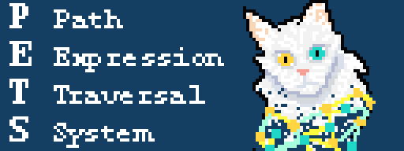
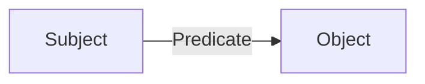
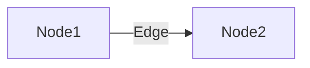
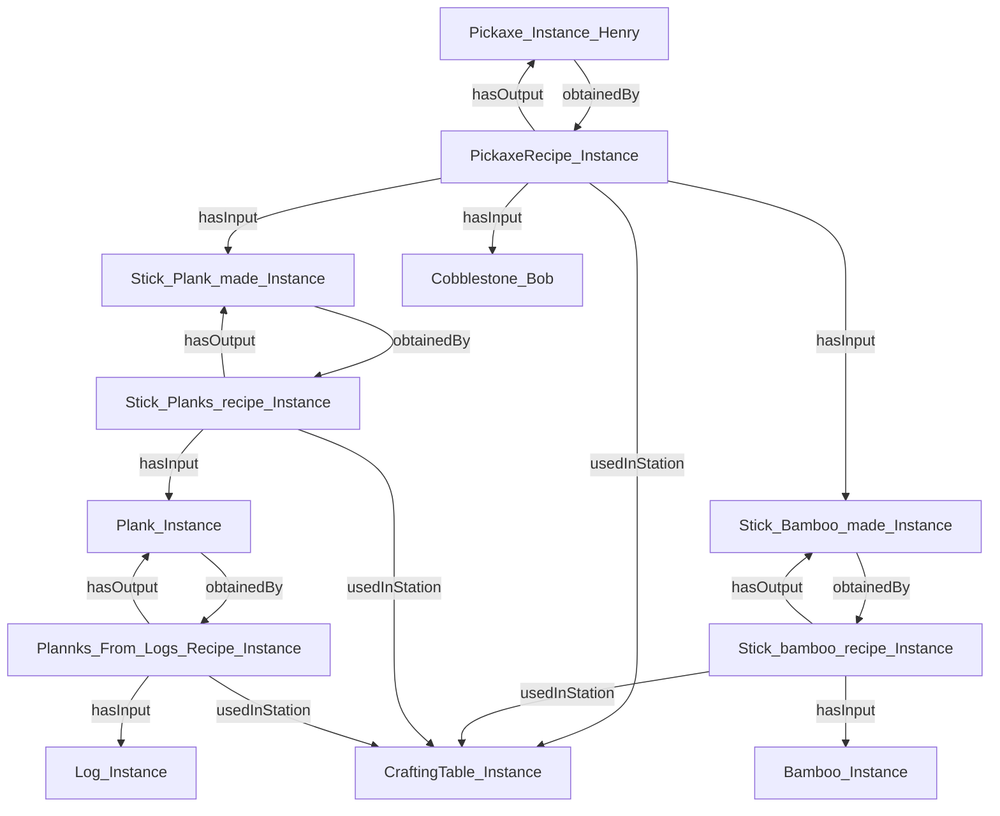
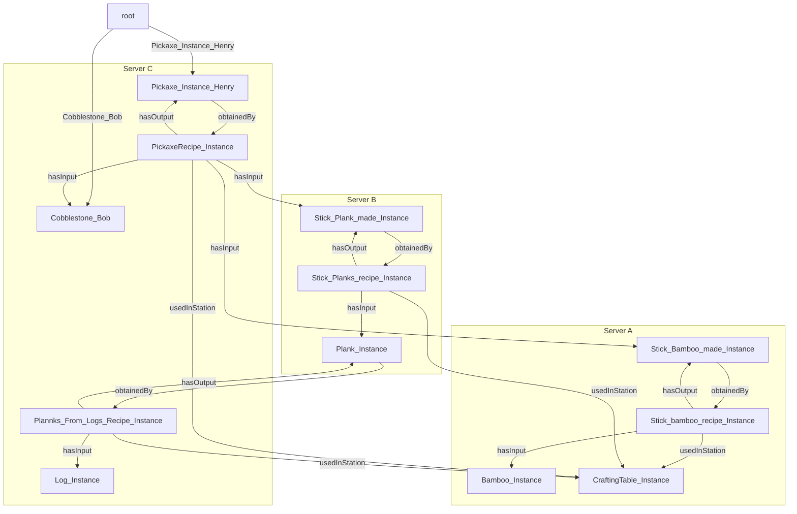
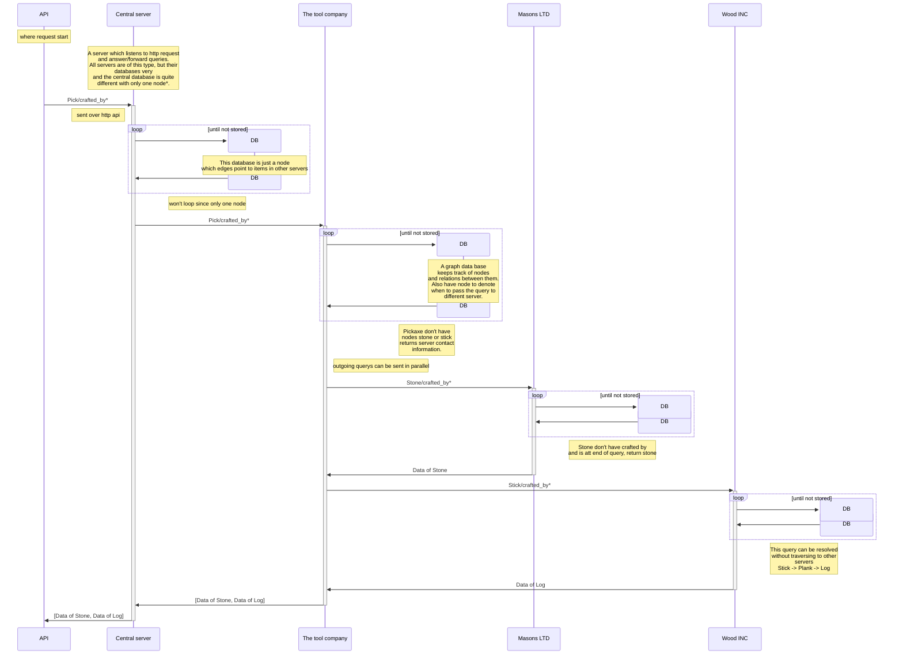
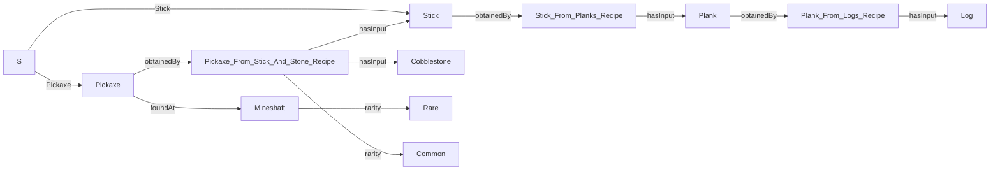

# Path-Expression-Traversal-System



PETS, a system to store linked distributed data with traversal functions

## Ontologies

An Ontology is a way to describe a relationship with a structure of subject, predicate and object. And our data is therefore a list of these structures which can be describe as following:



We call all subjects and objects nodes and predicates edges.



What we want to do is to search such an ontology structure using a query where this structure is spread over several servers. When we split an edge over different server we do that by making the first node point to a false node where that node contains all the information to navigate to the true node on the other server. 

## Node ontologies



## Node ontologies distributed



## Truly distributed data


## Introduction

Our system is designed to navigate and retrieve information from linked ontologies using path expressions. It enables users to traverse decentralized data structures by following relationships defined in path expressions, allowing for multilevel hierarchical exploration.
The system helps users efficiently access and analyze linked data. For example in a supply chain context, it can model the entire distribution network of a specific item by retrieving manufacturer data at each stage. This provides transparency, traceability, and deeper insights into complex data relationships.
Our solution is valuable for businesses, researchers, and data analysts who needs to explore and make sense of decentralized, linked data in a clear ond structured way. 


## From Qurery to Result

The user enter in a query, for example 
`S/Pickaxe/obtainedBy/crafting_recipe/hasInput` \
...
...
...

The Program will then attempt to build an evaluation tree.
First it gets passed into a preprocessing step where it removes whitespaces newlines and so on. It then gets checked so that it follows the requirments of the qury structure, for example no following operators, always closing parenthsees, etc.
It will then call a function to build the tree structure entering in the query and the available edges it can take in the program from the current server. Current limitations limits the program to the current server, in future development it would be ideal to be able to see edges stored in different servers. It will then pass it into the tree-building function 
that takes the query and seperates the operators into operator-nodes and stores the edges in leaf-nodes. This three is then used to query the DB.
The tree building process will repeat whenever the query is passed to a new server. After it has been passed to a new server it will also call the nextLeaf function that finds the next leaf that has to be visited by treversing the three with an in order walk and returning a pointer to the node.  


## Parsing the ontologies into GoLang

For this parsing function, nodes have been defined as struct containing an array (or slices in GoLang) with edges to the node. We also create a struct for edges with the properties "EdgeName" and "TargetName" with each property denoting how an item is obtained respectively what the edge is pointing to. One server can then save all these nodes in a hashmap (dictionary) with the key being the node name and the value, the DataNode struct.

```go
type DataNode struct {
    Edges []DataEdge
}
type DataEdge struct { // minecraft:obtainedBy minecraft:Stick_bamboo_recipe_Instance
    EdgeName   string  // obtainedBy
    TargetName string  // Stick_bamboo_recipe_Instance
}

var nodeLst map[string]DataNode    // Hashmap (or dictionary) with pairs of nodenames and DataNode
```

Reading the ontologies into Go is very simple. Since the ontologies follow a certain standard (Subject, Predicate, Object) we utilize this to read the subject prefix in order to infer the type of object and similarly what attributes it may have to apply them to our hashmap of nodes. Here is some rough pseudo-code on how the parsing works;

```go
    if strings.HasPrefix(line, "minecraft:") { // minecraft:Stick_Bamboo_made_Instance a minecraft:Stick ;

        temp := strings.TrimPrefix(line, "minecraft:") // Stick_Bamboo_made_Instance a minecraft:Stick ;

        wrd := getFirstWord(temp) // Get the first word in trimmed line; "Stick_Bamboo_made_Instance"

        nodeLst[wrd] = ""  // Declare a key "wrd" with value "" in the hashmap "nodeLst"
    }

    // Next line;       minecraft:obtainedBy minecraft:Stick_bamboo_recipe_Instance
    if strings.HasPrefix(line, "minecraft:EdgeName minecraft:TargetName"){
        var tempEdge DataEdge
        temp := strings.TrimPrefix(line, "minecraft:") //obtainedBy minecraft:Stick_bamboo_recipe_Instance
        firstName := getFirstWord(temp) // Get the first word in trimmed line; "obtainedBy"
        temp := strings.TrimPrefix(temp, "EdgeName minecraft:")
        secondName := getFirstWord(temp) // Get the second word in trimmed line; "Stick_bamboo_recipe_Instance"

        tempEdge.EdgeName = firstName
        tempEdge.TargetName = secondName

        nodeLst[wrd] = append(nodeLst[wrd], tempEdge)  // Append tempEdge to array of edges in node "wrd"
    }
```

## Architecture


<!-- Explain in words what happens in the sequence diagram -->


## Query structure

The query structure was designed for simplicity and not fines, the goal was an easy way to write path expressions with loops.



### Example 1, Simple traversal

To follow a simple path, first have the starting node (s in this case a we have not implemented a dht to resolve node location) followed by the edges name separated by `/`

`S/Pickaxe/obtainedBy/crafting_recipe/hasInput`

The example will start att pickaxe and follow edge `obtainedBy` to `Pickaxe_From_Stick_And_Stone_Recipe`
where the query will split and go to both `Cobblestone` and `stick`.
Since this is the end of the query they are returned.

### Example 2, groups {}

In the above example the query each operation was evaluated left to right, in some cases this might not be desired when using more complex operators such a loop (aka match zero or more)

``S/Pick/made_of/Crafting_recipie*``
``S/Pick/{made_of/Crafting_recipie}*``

In other cases we might want to do more complex
operations, for exapmle an AND or an XOR operation between edges, those are explained in further examples.

<!-- ### example arguments (), TO BE DECIDED

arguments could be added to loop operator? -->

### Example 3, Loop

Looping expressions, matching more than once, allowing for following a path of unknown length. The syntax is the to add a star around a group ``{...}*`` or if only a single edge requires looping the group can be omitted

``S/Pickaxe/{obtainedBy/hasInput}*``

will loop down by the edges obtainedBy/hasInput until it reaches the end

```text
Pickaxe --> Pickaxe_From_Stick_And_Stone_Recipe --> Stick --> Stick_From_Planks_Recipe --> Plank --> Plank_From_Logs_Recipe --> Log
Pickaxe --> Pickaxe_From_Stick_And_Stone_Recipe --> Cobblestone
```

Where both Cobblestone and Log would be returned.

``S/Pickaxe/{obtainedBy/hasInput}*/rarity``

after taking hasInput it will loop if available and go check the rarity if available if neither edge exist it returns as normal.

### Example 4, Or

Allows a path traversal to follow either edge

``S/Pickaxe/{obtainedBy/rarity|foundAt}/rarity``

```text
Pickaxe --> Pickaxe_From_Stick_And_Stone_Recipe --> Common
Pickaxe --> Mineshaft --> Rare
```

### Example 5, AND

Only allows the query to continue if both edges exist on the node, both are traversed

``S/Pickaxe/{obtainedBy & foundAt}/rarity`` would return

```text
Pickaxe --> Pickaxe_From_Stick_And_Stone_Recipe --> Common
Pickaxe --> Mineshaft --> Rare
```

``S/Stick/{obtainedBy & foundAt}/rarity`` would return nothing as stick dont have the edge foundAt.

### Example 6, XOR

Allows the query to continue, only if one of the edges exist

``S/Pickaxe/{obtainedBy ^ foundAt}/rarity`` would return

```text
Pickaxe --> Pickaxe_From_Stick_And_Stone_Recipe --> Common
Pickaxe --> Mineshaft --> Rare
```

``S/Stick/{obtainedBy ^ foundAt}/rarity`` would go down obtainedBy as it does not have the edge foundAt


## Parsing and constructing the evaluationTree

When constructing the evaluationTree the code calls the function func grow_tree(str string, parent Node, id *int) (Node, error)
providing the qury string, and the parent node, it returns a node and an error, the error is nil if it did not encounter an error in the function.
It then passes the string for some formatting, removing whitespaces, newlines and so on.

It then calls the function slit_q, where it separates oprators from non-operators(edges, bracket-sections or remainder), and returns them.
for example it starts matchin treversnodes, "/", and then finds another operator
everything to the right of the last treversenode will be treated as a remaider and added to the non-operators.

grow-tree then matches the returned operator and creates a matching node.
The node then takes all the parts and recursively calls growthreeon them, then assignes them as a child and appends it to its slice of children.


## Treversing the tree

When treversing the tree it will call  NextNode(caller Node, availablePaths []string) []*LeafNode,
that takes in the caller node, all the available paths on the server, and returns a slice of leafnode pointers.

Different nodes behaive differently when NextNode is called on them but the general behavior is that it calls the next child it has,
and if it was the last child that called it it calls its parents nextnode.

The recursive nextnode goes down to the firs leaf it finds (some nodes look for more then one leafnode) and returns a pointer to it.
When NextNode is caleld from a leaf it will find the next leaf in the evaluation order.

When the query is passed to a new server it has to recreate the tree and must then get a new pointer to the last visited leaf in the newly constructed tree, it then calls GetLeaf(id int) *LeafNode,
that takes in the id of a leaf and returns a pointer to it. 


## go style pseudo code

Note this is an example of part of the tree structure. 
This example will use the treverse- and leaf- node as an example.

```go
// interface type that all nodes need to implement
// it add the possibility to query for the next node, returns the leaf nodes that are next in the query
// And find the next leaf, returning a pointer to it
type Node interface {
	NextNode(Node, []string) []*LeafNode
	GetLeaf(int) *LeafNode
}

// A Traverse Node represent a traversal from right to left
type TraverseNode struct {
	Parent Node
	Children []Node 
}

// will simple passby and return a matching leafnode pointer or null (see leafnode)
func (t *TraverseNode) GetLeaf(id int) *LeafNode {
	// returns the first node where id matches or nil
	for i, _ := range t.Children {
		tmp := t.Children[i].GetLeaf(id)
		if tmp != nil {
			return tmp
		}
	}
	return nil
}

// node that implements the traverse function.
// If the parent calls it checks the fist node
// if a child calls it checks the next node
// if it is the last child it calls parents nextnode nad gets it's next child.
// returns a slice of leafnode pointers, empty if no matches or logic stops it.
func (t *TraverseNode) NextNode(caller Node, availablePaths []string) []*LeafNode {
	var leafs []*LeafNode
	// if caller is parent we check the "first" node
	if caller == t.Parent {
		leafs = append(leafs, t.Children[0].NextNode(t, availablePaths)...)
	// then we check all the following Children
	} else if caller != t.Children[len(t.Children)-1] {
		for i, n := range t.Children {
			if caller == n {
				leafs = append(leafs, t.Children[i+1].NextNode(t, availablePaths)...)
				break
			}
		}
	// untill we reach the last chil where we call the parent
	} else if caller == t.Children[len(t.Children)-1] {
		leafs = append(leafs, t.Parent.NextNode(t, availablePaths)...)
	} else {
		panic("Should not happen!")
	}
	return leafs
}

// A leaf node represent en edge in the query, these are also the leafs in the evaluation tree
type LeafNode struct {
	Parent Node
	Value  string
	ID     int
}

// will check if the id matches and return a pointer to itself if it does, nil if it doesnt
func (l *LeafNode) GetLeaf(id int) *LeafNode {
	if l.ID == id {
		return l
	}
	return nil
}

// Returns pointer to self in slice if parent called it
// if call came from nil take parents nextnode instead
func (l *LeafNode) NextNode(caller Node, availablePaths []string) []*LeafNode {
	if caller == l.Parent {
		return []*LeafNode{l}
	} else if caller == nil {
		return l.Parent.NextNode(l, availablePaths)
	} else {
		panic("leafnode nextnode panic")
	}
}

```


## Example of internal structure of a query

<!-- Note to readers, this look incredibly like the state machines that regex compiles to -->


### An example of evaluation

Lets take an example query of show its internal evaluation

``S/Pickaxe/{obtainedBy/hasInput}*``

This is then converted to a tree structure of operations, where the leafs are edges and nodes .

lets say that we are on edge ``obtainedBy``, and we want to know whats next.
By looking at the parent we know that we are on the left side of an *traverse*
and the next edge is the one on the right of the traverse, ``hasInput``

if whe should get the next node from ``hasInput`` we can again look att the parentO
and se that we are on the right side of the *traverse*,
to find the next node we need to look higher, the *traverse*'s parent.
This gives us the knowledge that we are on the left side of *loop* operator (aka *zero or more*)
We then have two possible options continue right or redo the left side.
by evaluating the left side we get ``obtainedBy`` again, showing us that the *loop* works.
the right sides gives us NULL, the end of the query an valid position to return.


## Current limitations and future development of the query structure


## The query wrapper

The evaluation tree, on its own, does not provide complete utility.
Therefore, a wrapper is constructed to include additional information necessary for graph traversal.
This wrapper specifies the next node to traverse and the edge along which to traverse.

With the aid of the evaluation tree, the next edges and subsequent nodes can be determined, and the traversal path can be updated,
provided we have access to the graph.
This process may necessitate splitting the query into multiple sub-queries in certain cases.
By applying this approach recursively, we can effectively navigate the graph.

Currently, the wrapper, which is responsible for initializing values and invoking the grow tree function,
lacks error handling and query syntax validation. For a system like this to be useful,
stability is crucial, which is currently not the case.

Implementing error handling for simple syntax errors is relatively straightforward.
However, more advanced error handling may require additional time due to potential edge cases,
particularly those involving Unicode.

### Syntax Validation

As mentioned previously, checking the syntax is very straightforward. We simply only need to check for invalid operator combinations with a few edge cases such as what starting/ending operators are allowed. 

### Passing the query to dirent servers

Since the data might not be stored on the same server,
we need the ability to send the query to the next server and return the results.
Each node that is not stored on the server has a ``false node`` with an edge labeled ``pointsToServer``.
This edge allows us to obtain the contact information needed to forward the query.

The query is then converted from its internal representation to a format suitable for transmission:

``QueryString;NextNode;AlongEdge``

- QueryString: The first part before the ; separator is the query itself, such as ``S/Pickaxe/{obtainedBy/hasInput}*``.
- NextNode: The second part indicates the intended destination server, for example, ``Cobblestone``.
- AlongEdge: The final part is an index into the query, indicating which edge within the query is used to reach the NextNode. For instance, an index of 3 would denote the edge ``hasInput``.

This information is sufficient to reconstruct the query and its state. In the current implementation, if state values are missing, the query is assumed to be new. The starting node is the first part of the query, and the edge is the same as the starting node.

<!-- something something error handling -->

## Webserver

A webserver is beneficial for our system because it acts as a bridge between users and the linked data processing. It allows us to interact with our system from anywhere using a simple HTTP request and it provides a unified interface for querying and retrieving linked data.
