# Path-Expression-Traversal-System


PETS, a system to store linked distributed data with traversal functions

## Introduction

In today’s data driven world, businesses rely on structured and interconnected data to optimize operations, enhance decision making, and ensure regulatory compliance. For example, in a supply chain context, a company manufacturing pharmaceuticals must track the origin of raw materials, verify supplier compliance, and ensure product quality. Our system enables such businesses to model and analyze the entire distribution network of a specific item by retrieving manufacturer data at each stage. This ensures transparency, traceability, and deeper insights into complex data relationships.

Our system is designed to navigate and retrieve information from linked ontologies using path expressions. It enables users to traverse decentralized data structures by following relationships defined in path expressions, allowing for multilevel hierarchical exploration. By leveraging ontologies, our solution provides structured access to decentralized, linked data, making it valuable for businesses, researchers, and data analysts who need to explore and make sense of interconnected information in a clear and efficient way.

## Table of contents

- [Introduction](#introduction)
- [Table of contents](#table-of-contents)
- [Installation](#installation)
- [Example](#example)
- [Ontologies](#ontologies)
- [Ontology text](#ontology-text)
- [Node ontologies](#node-ontologies)
  - [Node ontologies distributed](#node-ontologies-distributed)
  - [Truly distributed data](#truly-distributed-data)
- [From Query to Result](#from-query-to-result)
- [Getting data from the database](#getting-data-from-the-database)
- [Parsing the ontologies into GoLang](#parsing-the-ontologies-into-golang)
- [Architecture](#architecture)
- [Query structure](#query-structure)
  - [Example 1, Simple traversal](#example-1-simple-traversal)
  - [Example 2, groups {}](#example-2-groups-)
  - [Example 3, Loop](#example-3-loop)
  - [Example 4, OR](#example-4-or)
  - [Example 5, AND](#example-5-and)
  - [Example 6, XOR](#example-6-xor)
- [Parsing and constructing the evaluationTree](#parsing-and-constructing-the-evaluationtree)
- [Traversing the tree](#traversing-the-tree)
- [go style pseudo code](#go-style-pseudo-code)
- [Example of internal structure of a query](#example-of-internal-structure-of-a-query)
  - [An example of evaluation](#an-example-of-evaluation)
- [Syntax Validation](#syntax-validation)
- [The query wrapper](#the-query-wrapper)
  - [Passing the query to dirent servers](#passing-the-query-to-dirent-servers)
    - [The Common Header](#the-common-header)
    - [Payload for recursive mermaid query (type 0x1)](#payload-for-recursive-mermaid-query-type-0x1)
  - [Improvements and limitations of the query wrapper](#improvements-and-limitations-of-the-query-wrapper)
- [Webserver](#webserver)

## Installation

The application, defined in src, can be run two ways, as a docker container, or standalone on the system.
For the application to run in both cases it needs an connection to an GraphDB database,
connection details should be supplied by these environment variables

- ``GRAPHDB_HOSTNAME`` this is the hostname of the database, could be an ip or an domain, note that the port is fixed to 7200.
- ``GRAPHDB_REPOSITORY`` the graphDB repository that should be used.
- ``CASHING`` if set to "TRUE" the result from the GraphDB queries would be cashed indefinitely

The PETS protocol currently waits for http on port 80, but the application could send to other ports if defined so i the HasIp attribute in the database

## Example

We provide an example in this repo with the help of a docker compose file and example data files
as problem occurred with automatically loading data into graphDB this needs to be done manually.

The example creates 3 PETS servers and 3 graphDB instances, where PETS server C port 80 is exposed to the wider network.
To load the correct data for this test into the graph databases follow these steps

1. If the system has not yet started run the following command (from the compdir directory) ``docker compose up --build -d`` \
this will start the servers and graph databases
2. load the data into the databases
   1. connect to a graph db instance, 7200 is graph database link to server a, ``localhost:7200`` \
   
   2. Then the repository containing our data needs to be created, to crete ar repository we need to go to setup and repositories,
   there we will find the create repository button \
   
   3. wh can then crete a repository, by first choosing GraphDB Repository and the filling out relevant information.
   In the example file we set the environment variable for the repository name to ``PETSrep`` make sure to match it \
    \
   
   4. We then need to load the data into our repository, go to import and select our PETSrep,
   we can then select Upload RDF files to load our data, since we are connected to server A (port 7200),
   we chose ``Example Data/Server A/Example Data_A.ttl``, then press import. \
    \
   
3. repeat the steps in 2 for server B (port 7201) and C (port 7202).

To test the system with the example data open a browser and connect to port 80 (default port) the following query could be run \
``minecraft:Pickaxe_Instance_Henry/{minecraft:obtainedBy/minecraft:hasInput}*``


## Ontologies

An Ontology is a way to describe a relationship with a structure of subject, predicate and object. And our data is therefore a list of these structures which can be describe as following:


We call all subjects and objects nodes and predicates edges.


What we want to do is to search a node network based on a ontology structure using a query where this structure is spread over several servers. When we split an edge over different server we do that by making the first node point to a false node where that node contains all the information to navigate to the true node on the other server.

## Example Data text

Here is a version of the example data on server C

```ttl
@prefix minecraft: <http://example.org/minecraft#> .
@prefix nodeOntology: <http://example.org/NodeOntology#> .

# Instances of Items
minecraft:Stick_Plank_made_Instance a minecraft:Stick ;
 nodeOntology:hasID 1 ;
 nodeOntology:pointsToServer minecraft:Server_b .

minecraft:Stick_Bamboo_made_Instance a minecraft:Stick ;
 nodeOntology:hasID 2 ;
 nodeOntology:pointsToServer minecraft:Server_a .

minecraft:Cobblestone_Bob a minecraft:Cobblestone ;
 nodeOntology:hasID 3 .

minecraft:Log_Instance a minecraft:Log ;
 nodeOntology:hasID 12 .

minecraft:Pickaxe_Instance_Henry a minecraft:Pickaxe ;
 nodeOntology:hasID 4 ;
 minecraft:obtainedBy minecraft:PickaxeRecipe_Instance .

minecraft:Server_a a nodeOntology:Server ;
 nodeOntology:hasIP "a" .


minecraft:Server_b a nodeOntology:Server ;
 nodeOntology:hasIP "b" .


minecraft:Plank_Instance a minecraft:Plank ;
 nodeOntology:hasID 7 ;
 nodeOntology:pointsToServer minecraft:Server_b .

# Crafting Station Instance
minecraft:CraftingTable_Instance a minecraft:CraftingTable ;
 nodeOntology:pointsToServer minecraft:Server_a ;
 nodeOntology:hasID 8 .

# Recipe Instance: Pickaxe_From_Stick_And_Stone_Recipe 
minecraft:PickaxeRecipe_Instance a minecraft:Pickaxe_From_Stick_And_Stone_Recipe ;
 nodeOntology:hasID 9 ;
 minecraft:hasInput minecraft:Stick_Plank_made_Instance  ;
 minecraft:hasInput minecraft:Stick_Bamboo_made_Instance ;
 minecraft:hasInput minecraft:Cobblestone_Bob ;
 minecraft:hasOutput minecraft:Pickaxe_Instance_Henry ;
 minecraft:usedInStation minecraft:CraftingTable_Instance .

# Recipe Instance: Plank_recipie_Log
minecraft:Plannks_From_Logs_Recipe_Instance a minecraft:Plannks_From_Logs_Recipe ;
 nodeOntology:hasID 13 ;
 minecraft:hasInput minecraft:Log_Instance ;
 minecraft:hasOutput minecraft:Plank_Instance ;
 minecraft:usedInStation minecraft:CraftingTable_Instance .
```

Here is the Main(PETS) Ontology:

```
@prefix rdf: <http://www.w3.org/1999/02/22-rdf-syntax-ns#> .
@prefix rdfs: <http://www.w3.org/2000/01/rdf-schema#> .
@prefix owl: <http://www.w3.org/2002/07/owl#> .
@prefix nodeOntology: <http://example.org/NodeOntology#> .


nodeOntology: a owl:Ontology ;
    rdfs:comment "An RDFS Ontology for PETS's node System." ;
    rdfs:label "PETS's node Ontology" .

nodeOntology:Server a owl:Class ;
 rdfs:comment "A way to another server" ;
    rdfs:label "Server" .

#Define_properties

nodeOntology:pointsToServer a rdf:pointsToNode ;
    rdfs:domain nodeOntology:NodeFalse ;
    rdfs:range nodeOntology:Server ;
    rdfs:comment "Links a Node to a Server ".

nodeOntology:hasIP a rdfs:Property ;
 rdfs:domain nodeOntology:Server ;
 rdfs:range xsd:string . # store IP addres as String
 
nodeOntology:hasID a rdfs:Property ;
 rdfs:domain nodeOntology:Node ;
 rdfs:range xsd:int  . # store ID addres as String
```

## Node ontologies


### Node ontologies distributed


### Truly distributed data

```mermaid
graph TD;
subgraph Server_a
Server_a_minecraft:Server_b[(Server_b)]
end

subgraph Server_a
Server_a_minecraft:Stick_Bamboo_made_Instance([Stick_Bamboo_made_Instance])
end
Server_a_minecraft:Stick_Bamboo_made_Instance-->|obtainedBy|Server_a_minecraft:Stick_bamboo_recipe_Instance

subgraph Server_a
Server_a_minecraft:Bamboo_Instance([Bamboo_Instance])
end

subgraph Server_a
Server_a_minecraft:CraftingTable_Instance([CraftingTable_Instance])
end

subgraph Server_a
Server_a_minecraft:Stick_bamboo_recipe_Instance([Stick_bamboo_recipe_Instance])
end
Server_a_minecraft:Stick_bamboo_recipe_Instance-->|hasInput|Server_a_minecraft:Bamboo_Instance
Server_a_minecraft:Stick_bamboo_recipe_Instance-->|hasOutput|Server_a_minecraft:Stick_Bamboo_made_Instance
Server_a_minecraft:Stick_bamboo_recipe_Instance-->|usedInStation|Server_a_minecraft:CraftingTable_Instance

subgraph Server_a
Server_a_minecraft:Plank_from_Bamboo_Instance[Plank_from_Bamboo_Instance]
end
Server_a_minecraft:Plank_from_Bamboo_Instance-->|inter_server|Server_b_minecraft:Plank_from_Bamboo_Instance
Server_a_minecraft:Plank_from_Bamboo_Instance-->|pointsToServer|Server_a_minecraft:Server_b

subgraph Server_a
Server_a_minecraft:Plank_from_bamboo_recipe_Instance([Plank_from_bamboo_recipe_Instance])
end
Server_a_minecraft:Plank_from_bamboo_recipe_Instance-->|hasInput|Server_a_minecraft:Bamboo_Instance
Server_a_minecraft:Plank_from_bamboo_recipe_Instance-->|hasOutput|Server_a_minecraft:Plank_from_Bamboo_Instance
Server_a_minecraft:Plank_from_bamboo_recipe_Instance-->|usedInStation|Server_a_minecraft:CraftingTable_Instance

subgraph Server_b
Server_b_minecraft:Stick_Plank_made_Instance([Stick_Plank_made_Instance])
end
Server_b_minecraft:Stick_Plank_made_Instance-->|obtainedBy|Server_b_minecraft:Stick_Planks_recipe_Instance

subgraph Server_b
Server_b_minecraft:Server_a[(Server_a)]
end

subgraph Server_b
Server_b_minecraft:Server_c[(Server_c)]
end

subgraph Server_b
Server_b_minecraft:Plank_Instance([Plank_Instance])
end
Server_b_minecraft:Plank_Instance-->|obtainedBy|Server_b_minecraft:Plannks_From_Logs_Recipe_Instance

subgraph Server_b
Server_b_minecraft:CraftingTable_Instance[CraftingTable_Instance]
end
Server_b_minecraft:CraftingTable_Instance-->|inter_server|Server_a_minecraft:CraftingTable_Instance
Server_b_minecraft:CraftingTable_Instance-->|pointsToServer|Server_b_minecraft:Server_a

subgraph Server_b
Server_b_minecraft:Stick_Planks_recipe_Instance([Stick_Planks_recipe_Instance])
end
Server_b_minecraft:Stick_Planks_recipe_Instance-->|hasInput|Server_b_minecraft:Plank_Instance
Server_b_minecraft:Stick_Planks_recipe_Instance-->|hasInput|Server_b_minecraft:Plank_from_Bamboo_Instance
Server_b_minecraft:Stick_Planks_recipe_Instance-->|hasOutput|Server_b_minecraft:Stick_Plank_made_Instance
Server_b_minecraft:Stick_Planks_recipe_Instance-->|usedInStation|Server_b_minecraft:CraftingTable_Instance

subgraph Server_b
Server_b_minecraft:Plannks_From_Logs_Recipe_Instance[Plannks_From_Logs_Recipe_Instance]
end
Server_b_minecraft:Plannks_From_Logs_Recipe_Instance-->|inter_server|Server_c_minecraft:Plannks_From_Logs_Recipe_Instance
Server_b_minecraft:Plannks_From_Logs_Recipe_Instance-->|pointsToServer|Server_b_minecraft:Server_c

subgraph Server_b
Server_b_minecraft:Plank_from_Bamboo_Instance([Plank_from_Bamboo_Instance])
end
Server_b_minecraft:Plank_from_Bamboo_Instance-->|obtainedBy|Server_b_minecraft:Plank_from_bamboo_recipe_Instance

subgraph Server_b
Server_b_minecraft:Plank_from_bamboo_recipe_Instance[Plank_from_bamboo_recipe_Instance]
end
Server_b_minecraft:Plank_from_bamboo_recipe_Instance-->|inter_server|Server_a_minecraft:Plank_from_bamboo_recipe_Instance
Server_b_minecraft:Plank_from_bamboo_recipe_Instance-->|pointsToServer|Server_b_minecraft:Server_a

subgraph Server_c
Server_c_minecraft:Stick_Plank_made_Instance[Stick_Plank_made_Instance]
end
Server_c_minecraft:Stick_Plank_made_Instance-->|inter_server|Server_b_minecraft:Stick_Plank_made_Instance
Server_c_minecraft:Stick_Plank_made_Instance-->|pointsToServer|Server_c_minecraft:Server_b

subgraph Server_c
Server_c_minecraft:Stick_Bamboo_made_Instance[Stick_Bamboo_made_Instance]
end
Server_c_minecraft:Stick_Bamboo_made_Instance-->|inter_server|Server_a_minecraft:Stick_Bamboo_made_Instance
Server_c_minecraft:Stick_Bamboo_made_Instance-->|pointsToServer|Server_c_minecraft:Server_a

subgraph Server_c
Server_c_minecraft:Cobblestone_Bob([Cobblestone_Bob])
end

subgraph Server_c
Server_c_minecraft:Log_Instance([Log_Instance])
end

subgraph Server_c
Server_c_minecraft:Pickaxe_Instance_Henry([Pickaxe_Instance_Henry])
end
Server_c_minecraft:Pickaxe_Instance_Henry-->|obtainedBy|Server_c_minecraft:PickaxeRecipe_Instance

subgraph Server_c
Server_c_minecraft:Pickaxe_Instance_Gustav([Pickaxe_Instance_Gustav])
end

subgraph Server_c
Server_c_minecraft:Server_a[(Server_a)]
end

subgraph Server_c
Server_c_minecraft:Server_b[(Server_b)]
end

subgraph Server_c
Server_c_minecraft:Plank_Instance[Plank_Instance]
end
Server_c_minecraft:Plank_Instance-->|inter_server|Server_b_minecraft:Plank_Instance
Server_c_minecraft:Plank_Instance-->|pointsToServer|Server_c_minecraft:Server_b

subgraph Server_c
Server_c_minecraft:CraftingTable_Instance[CraftingTable_Instance]
end
Server_c_minecraft:CraftingTable_Instance-->|inter_server|Server_a_minecraft:CraftingTable_Instance
Server_c_minecraft:CraftingTable_Instance-->|pointsToServer|Server_c_minecraft:Server_a

subgraph Server_c
Server_c_minecraft:PickaxeRecipe_Instance([PickaxeRecipe_Instance])
end
Server_c_minecraft:PickaxeRecipe_Instance-->|hasInput|Server_c_minecraft:Stick_Plank_made_Instance
Server_c_minecraft:PickaxeRecipe_Instance-->|hasInput|Server_c_minecraft:Stick_Bamboo_made_Instance
Server_c_minecraft:PickaxeRecipe_Instance-->|hasInput|Server_c_minecraft:Cobblestone_Bob
Server_c_minecraft:PickaxeRecipe_Instance-->|hasOutput|Server_c_minecraft:Pickaxe_Instance_Henry
Server_c_minecraft:PickaxeRecipe_Instance-->|usedInStation|Server_c_minecraft:CraftingTable_Instance

subgraph Server_c
Server_c_minecraft:Plannks_From_Logs_Recipe_Instance([Plannks_From_Logs_Recipe_Instance])
end
Server_c_minecraft:Plannks_From_Logs_Recipe_Instance-->|hasInput|Server_c_minecraft:Log_Instance
Server_c_minecraft:Plannks_From_Logs_Recipe_Instance-->|hasOutput|Server_c_minecraft:Plank_Instance
Server_c_minecraft:Plannks_From_Logs_Recipe_Instance-->|usedInStation|Server_c_minecraft:CraftingTable_Instance
```



## From Query to Result

The user enter in a query, for example
`S/Pickaxe/obtainedBy/crafting_recipe/hasInput` \
that is being sent with a JSON request {"data":"S/Pickaxe/obtainedBy/crafting_recipe/hasInput#100"} to the webserver to be traversed.
The number after # represents the ttl (Time to live) thats being inputted at the website, with the default value of 100.

When the server receives an query from the website, It goes through syntax validation so that it follows the requirements of the query structure,
for example making sure there are no following operators, there are always closing brackets, etc.
If the query is deemed valid, a query struct is made with the relevant information, such as a newly generated uuid.
The Query requires an evaluation tree to find the next edges, which can be constructed from the query.

Firstly, a function call is made to build the tree structure by recursively separating the operators and edges, storing them in respective operator and leaf nodes.

Then, with an evaluation tree now built, traversal can begin. The traversal is similar to an in-order walk, but with the added condition of checking the operator node to determine how to proceed. For example, upon reaching an AND-node, the children are checked to see if they all exist and return them if they do. The edges it can reach are ones inside the server host. Ideally, edges in different servers should be reachable.

To get edge & node information from the database a query is sent asking for every predicate and corresponding object of the subject which is then searched for when the predicate equals the edge witch is requested.

With this walk in the evaluation tree whe have the edges we should traverse along, and if multiple destinations exist, the query is split.
If the node is determined to be a false node, by the existence of the edge ``NodeOntology:PointsToServer``,
the contact information is retrieved from the ServerNode that the edge PointsToServer points to.
With this contact information the query is serialized to a stream of bytes (se the [query wrapper](#the-query-wrapper) for information)
and sent over the network (currently carried by the http protocol but could easily be retrofitted for pure tcp)

When the query is received at the other server the tree building process will repeat,
and with the help of other information passed along in the query the full state can be reconstructed.

While the query is traversing, it's continuously* streaming back the path it takes in mermaid syntax and gets collected at the start server to then be displayed on the website.

## Getting data from the database

Here is an example of what is sent to the database:

```ttl
PREFIX nodeOntology: <http://example.org/NodeOntology#>
PREFIX minecraft: <http://example.org/minecraft#>
SELECT ?p ?o WHERE { minecraft:Pickaxe_Instance_Henry ?p ?o } limit 100
```

where the response would be:

```ttl
rdf:type | minecraft:Pickaxe
nodeOntology:hasID | 4
minecraft:obtainedBy | minecraft:PickaxeRecipe_Instance
```

as a hash map with the edges as keys and the nodes as value.


## Architecture


<!-- TODO Explain in words what happens in the sequence diagram -->

## Query structure

The query structure was designed for simplicity and not fines, the goal was an easy way to write path expressions with loops.


### Example 1, Simple traversal

To follow a simple path, first have the starting node (s in this case a we have not implemented a dht to resolve node location) followed by the edges name separated by `/`

`S/Pickaxe/obtainedBy/crafting_recipe/hasInput`

The example will start at pickaxe and follow edge `obtainedBy` to `Pickaxe_From_Stick_And_Stone_Recipe`
where the query will split and go to both `Cobblestone` and `stick`.
Since this is the end of the query they are returned.

### Example 2, groups {}

In the above example the query each operation was evaluated left to right, in some cases this might not be desired when using more complex operators such a loop (aka match zero or more)

``S/Pick/made_of/Crafting_recipie*``
``S/Pick/{made_of/Crafting_recipie}*``

In other cases we might want to do more complex
operations, for example an AND or an XOR operation between edges, those are explained in further examples.

<!-- ### example arguments (), TO BE DECIDED

arguments could be added to loop operator? -->

### Example 3, Loop

Looping expressions, matching more than once, allowing for following a path of unknown length. The syntax is the to add a star around a group ``{...}*`` or if only a single edge requires looping the group can be omitted

``S/Pickaxe/{obtainedBy/hasInput}*``

will loop down by the edges obtainedBy/hasInput until it reaches the end

```text
Pickaxe --> Pickaxe_From_Stick_And_Stone_Recipe --> Stick --> Stick_From_Planks_Recipe --> Plank --> Plank_From_Logs_Recipe --> Log
Pickaxe --> Pickaxe_From_Stick_And_Stone_Recipe --> Cobblestone
```

Where both Cobblestone and Log would be returned.

``S/Pickaxe/{obtainedBy/hasInput}*/rarity``

after taking hasInput it will loop if available and go check the rarity if available if neither edge exist it returns as normal.

### Example 4, OR

Allows a path traversal to follow either edge

``S/Pickaxe/{obtainedBy/rarity|foundAt}/rarity``

```text
Pickaxe --> Pickaxe_From_Stick_And_Stone_Recipe --> Common
Pickaxe --> Mineshaft --> Rare
```

### Example 5, AND

Only allows the query to continue if both edges exist on the node, both are traversed

``S/Pickaxe/{obtainedBy & foundAt}/rarity`` would return

```text
Pickaxe --> Pickaxe_From_Stick_And_Stone_Recipe --> Common
Pickaxe --> Mineshaft --> Rare
```

``S/Stick/{obtainedBy & foundAt}/rarity`` would return nothing as stick don't have the edge foundAt.

### Example 6, XOR

Allows the query to continue, only if one of the edges exist

``S/Pickaxe/{obtainedBy ^ foundAt}/rarity`` would return

```text
Pickaxe --> Pickaxe_From_Stick_And_Stone_Recipe --> Common
Pickaxe --> Mineshaft --> Rare
```

``S/Stick/{obtainedBy ^ foundAt}/rarity`` would go down obtainedBy as it does not have the edge foundAt

## Parsing and constructing the evaluationTree

When constructing the evaluationTree the code calls the function func grow_tree(str string, parent Node, id *int) (Node, error)
providing the query string, and the parent node, it returns a node and an error, the error is nil if it did not encounter an error in the function.
It then passes the string for some formatting, removing whitespaces, newlines and so on.

It then calls the function slit_q, where it separates operators from non-operators(edges, bracket-sections or remainder), and returns them.
for example it starts matching traverseNodes, "/", and then finds another operator
everything to the right of the last traverseNode will be treated as a remainder and added to the non-operators.

grow-tree then matches the returned operator and creates a matching node.
The node then takes all the parts and recursively calls growTree on them, then assigns them as a child and appends it to its slice of children.

A/B/{C|D|E}*{F&G}

<https://github.com/user-attachments/assets/1eec223d-1153-4555-9fdf-6d42b714fef4>

## Traversing the tree

When traversing the tree it will call  NextNode(caller Node, availablePaths []string) []*LeafNode,
that takes in the caller node, all the available paths on the server, and returns a slice of leafNode pointers.

Different nodes behave differently when NextNode is called on them but the general behavior is that it calls the next child it has,
and if it was the last child that called it calls its parents nextNode.

The recursive nextNode goes down to the first leaf it finds (some nodes look for more then one leafNode) and returns a pointer to it.
When NextNode is called from a leaf it will find the next leaf in the evaluation order.

When the query is passed to a new server it has to recreate the tree and must then get a new pointer to the last visited leaf in the newly constructed tree, it then calls GetLeaf(id int) *LeafNode,
that takes in the id of a leaf and returns a pointer to it.

<https://github.com/user-attachments/assets/60283f12-b982-4da7-be1f-c4a5cb7b2a4d>

## go style pseudo code

Note this is an example of part of the tree structure.
This example will use the traverse- and leaf- node as an example.

```go
// interface type that all nodes need to implement
// it add the possibility to query for the next node, returns the leaf nodes that are next in the query
// And find the next leaf, returning a pointer to it
type Node interface {
 NextNode(Node, []string) []*LeafNode
 GetLeaf(int) *LeafNode
}

// A Traverse Node represent a traversal from right to left
type TraverseNode struct {
 Parent Node
 Children []Node 
}

// will simple pass by and return a matching leafNode pointer or null (see leafNode)
func (t *TraverseNode) GetLeaf(id int) *LeafNode {
 // returns the first node where id matches or nil
 for i, _ := range t.Children {
  tmp := t.Children[i].GetLeaf(id)
  if tmp != nil {
   return tmp
  }
 }
 return nil
}

// node that implements the traverse function.
// If the parent calls it checks the fist node
// if a child calls it checks the next node
// if it is the last child it calls parents nextNode nad gets it's next child.
// returns a slice of leafNode pointers, empty if no matches or logic stops it.
func (t *TraverseNode) NextNode(caller Node, availablePaths []string) []*LeafNode {
 var leafs []*LeafNode
 // if caller is parent we check the "first" node
 if caller == t.Parent {
  leafs = append(leafs, t.Children[0].NextNode(t, availablePaths)...)
 // then we check all the following Children
 } else if caller != t.Children[len(t.Children)-1] {
  for i, n := range t.Children {
   if caller == n {
    leafs = append(leafs, t.Children[i+1].NextNode(t, availablePaths)...)
    break
   }
  }
 // until we reach the last child where we call the parent
 } else if caller == t.Children[len(t.Children)-1] {
  leafs = append(leafs, t.Parent.NextNode(t, availablePaths)...)
 } else {
  panic("Should not happen!")
 }
 return leafs
}

// A leaf node represent en edge in the query, these are also the leafs in the evaluation tree
type LeafNode struct {
 Parent Node
 Value  string
 ID     int
}

// will check if the id matches and return a pointer to itself if it does, nil if it doesn't
func (l *LeafNode) GetLeaf(id int) *LeafNode {
 if l.ID == id {
  return l
 }
 return nil
}

// Returns pointer to self in slice if parent called it
// if call came from nil take parents nextNode instead
func (l *LeafNode) NextNode(caller Node, availablePaths []string) []*LeafNode {
 if caller == l.Parent {
  return []*LeafNode{l}
 } else if caller == nil {
  return l.Parent.NextNode(l, availablePaths)
 } else {
  panic("leafNode nextNode panic")
 }
}

```

## Example of internal structure of a query

<!-- Note to readers, this look incredibly like the state machines that regex compiles to -->


### An example of evaluation

Lets take an example query of show its internal evaluation

``S/Pickaxe/{obtainedBy/hasInput}*``

This is then converted to a tree structure of operations, where the leafs are edges and nodes.

Lets say that we are on edge ``obtainedBy``, and we want to know whats next.
By looking at the parent we know that we are on the left side of an *traverse*
and the next edge is the one on the right of the traverse, ``hasInput``.

If we should get the next node from ``hasInput`` we can again look att the parentO
and see that we are on the right side of the *traverse*,
to find the next node we need to look higher, the *traverse*'s parent.
This gives us the knowledge that we are on the left side of *loop* operator (aka *zero or more*)
We then have two possible options continue right or redo the left side.
By evaluating the left side we get ``obtainedBy`` again, showing us that the *loop* works.
The right sides gives us NULL, the end of the query an valid position to return.

## Syntax Validation

As mentioned previously, checking the syntax is very straightforward. We simply only need to check for invalid operator combinations with a few edge cases such as what starting/ending operators are allowed.

## The query wrapper

The evaluation tree, on its own, does not provide complete utility.
Therefore, a wrapper is constructed to include additional information necessary for graph traversal.
Before the construction of this warper functions that validate the syntax of the query is executed to make sure no problems would arise in the evaluation tree
This wrapper specifies the next node to traverse and the edge along which to traverse.

With the aid of the evaluation tree, the next edges and subsequent nodes can be determined, and the traversal path can be updated,
provided we have access to the graph.
This process may necessitate splitting the query into multiple sub-queries in certain cases.
By applying this approach recursively, we can effectively navigate the graph.

During the evaluation, multiple events can occur that require error handling, such as the expiration of the time to live,
a failed connection to the database, or an error resulting from passing the query to another server.
These errors are converted to valid Mermaid syntax and piped along with the rest of the results.

An example on how an ttl error looks, first row is the error, second the query, third the curent node, and list the edge index used to get to that node, and the name of the edge.


Implementing error handling for simple syntax errors is relatively straightforward.
However, more advanced error handling may require additional time due to potential edge cases,
particularly those involving Unicode.

### Passing the query to dirent servers

To pass data and queries to different servers an common protocol is needed, this is described below.

#### The Common Header

The common header for all queries include general information that is needed for the system.
These include an magic to determine if its actually an PETS query, Query type, an identifying UUID and TTL.
The body to this header is determined by the type.

There might be further changes to this standard to include multiple variable with authorizations tokens in further development. This would allow advanced functions such as to hide internal paths to non authorized users, but still propagate the query thru the network.


#### Payload for recursive mermaid query (type 0x1)

Since the data might not be stored on the same server,
we need the ability to send the query to the next server and return the results.
Each node that is not stored on the server has a ``false node`` with an edge labeled ``pointsToServer``.
This edge allows us to obtain the contact information needed to forward the query.

The query is then converted from its internal representation to a format suitable for transmission in the payload, in this case a simple string:

``QueryString;NextNode;AlongEdge``

- QueryString: The first part before the ; separator is the query itself, such as ``S/Pickaxe/{obtainedBy/hasInput}*``.
- NextNode: The second part indicates the intended destination server, for example, ``Cobblestone``.
- AlongEdge: The final part is an index into the query, indicating which edge within the query is used to reach the NextNode. For instance, an index of 3 would denote the edge ``hasInput``.

This information is sufficient to reconstruct the query and its state. In the current implementation,
if state values are missing, the query is assumed to be new. The starting node is the first part of the query, and the edge is the same as the starting node.

The return of *recursive mermaid query* is always a valid mermaid string, when error are encountered during the traversal its converted to an valid mermaid syntax,
such as node with custom styling containing the error message, if possible an arrow to the node that the error occurred in is also drawn.

### Improvements and limitations of the query wrapper

Currently, the Query wrapper, responsible for traversing the data, is single-threaded and uses a depth-first evaluation approach.
The query speed could be significantly improved by adopting a breadth-first, multi-threaded approach.
This is because the system is primarily I/O-bound,
either waiting for data from the database or passing results from another server, even with cached database results.

By utilizing Go's green threads (Goroutines), the query could be evaluated in parallel.
It is important to note that green threads are not system threads, so asynchronous versions of I/O operations need to be used to avoid blocking.
This might require changes to how communication between the db and other servers are done internally.

Another dramatic speedup could be achieved by switching from HTTP to TCP. The system was originally designed with TCP in mind,
as evidenced by the use of custom binary headers and the lack of use off HTTP functionality beyond its message-carrying capability.
HTTP requires buffering the entire message before sending it over the wire because it is designed to send fixed-size data, as indicated by the content-length header.
By transferring data over TCP, unnecessary buffering is avoided, leading to lower latency and reduced memory usage.

To implement both these improvements, the primary challenge is determining when to split the evaluation,
as creating one green thread per traversal step would likely incur significant overhead in creation and context switching.
Another issue is protecting writes to the response stream to avoid interweaved characters in the Mermaid syntax.
This could be achieved by buffering lines and ensuring each line is fully written before writing the next one.
An exception to this would be the multiline blocks that represent errors, but this could be resolved by checking for opening and closing brackets in the Mermaid syntax.

A thing to note is that there were unit test for this structure but due to time constraints these were dropped when the system was changed from using ttl files to an actual database.
This was because the functions for database access are not related to an interface are global, by using an interface test data can again be passed to the tests, this would also allow
for multiple "backends" to be used.

When evaluating the query for traversal the nodes are today limited to only the from current node, this limits the current operator to only deal with the currents nodes edges.
It would also be beneficial to add some more nodes/operators allowing to create more a precise query.

## Webserver

A webserver is beneficial for our system because it acts as a bridge between users and the linked data processing.
It allows us to interact with our system from anywhere using a simple HTTP request and it provides a unified interface for querying and retrieving linked data.

<!-- TODO write about rendering mermaid -->
Mermaid.js renders diagrams by converting text-based syntax into scalable vector graphics (SVG). When a user submits a query, the server responds with a Mermaid-formatted string. This string is dynamically inserted into an HTML `<div>` with the class mermaid. The mermaid.init() function scans the document for elements with the .mermaid class and processes the text inside them, transforming it into a structured SVG diagram. This enables easy visualization of flowcharts, sequence diagrams, and other graph types directly in the browser without additional rendering tools.
